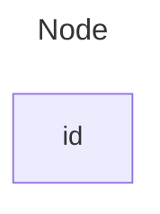


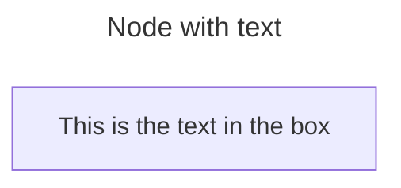


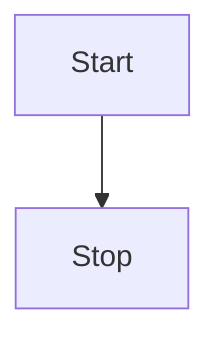


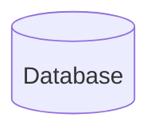


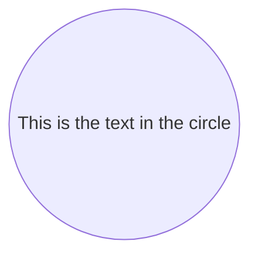


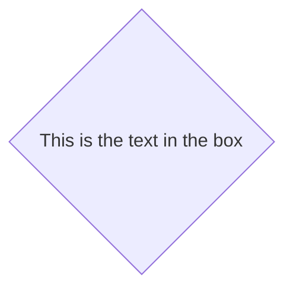


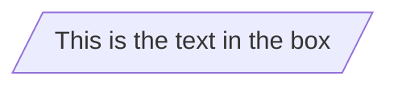


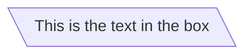


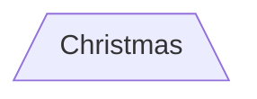


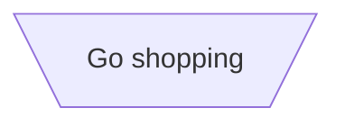


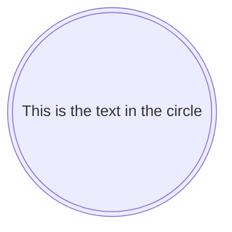


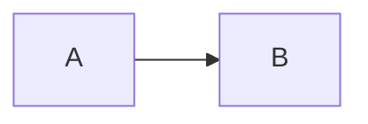


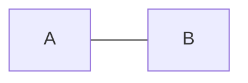


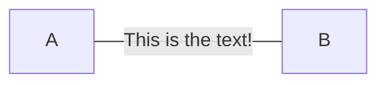


```mermaid

flowchart LR
    A---|This is the text|B

```


```mermaid
flowchart LR
    A-->|text|B


```


```mermaid
flowchart LR
   A-.->B;


```


```mermaid
flowchart LR
   A-. text .-> B


```


```mermaid

flowchart LR
   A ==> B

```


```mermaid

flowchart LR
   A == text ==> B

```


```mermaid

flowchart LR
   A -- text --> B -- text2 --> C

```


```mermaid
flowchart LR
   a --> b & c--> d


```


```mermaid
flowchart TB
    A & B--> C & D


```


```mermaid
flowchart TB
    A --> C
    A --> D
    B --> C
    B --> D


```


```mermaid
flowchart LR
    A --o B
    B --x C


```


```mermaid
flowchart LR
    A o--o B
    B <--> C
    C x--x D


```


```mermaid


```


```mermaid


```


```mermaid


```


```mermaid


```


```mermaid


```


```mermaid


```


```mermaid


```


```mermaid


```


```mermaid


```


```mermaid


```


```mermaid


```


```mermaid


```


```mermaid


```


```mermaid


```


```mermaid


```


```mermaid


```


```mermaid


```


```mermaid


```


```mermaid


```


```mermaid


```


```mermaid


```


```mermaid


```


```mermaid


```


```mermaid


```


