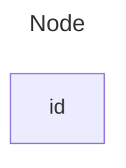


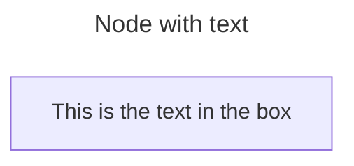


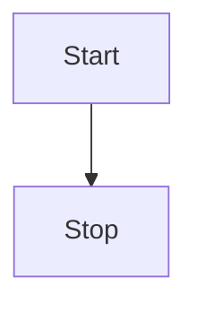


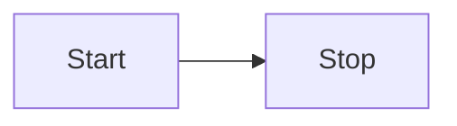


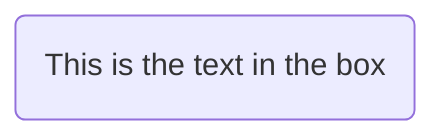


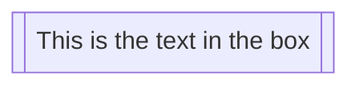


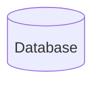


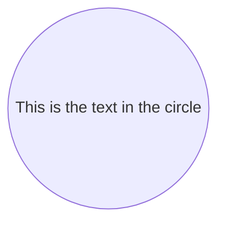


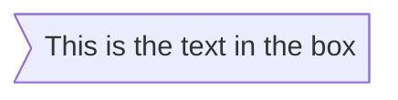


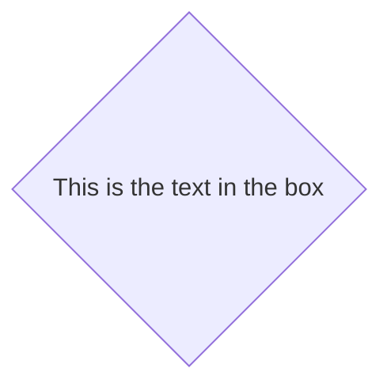


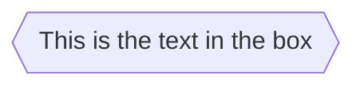


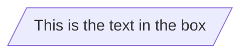


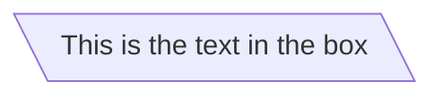


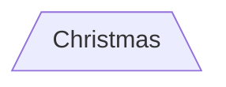


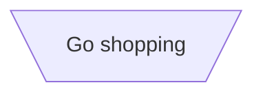


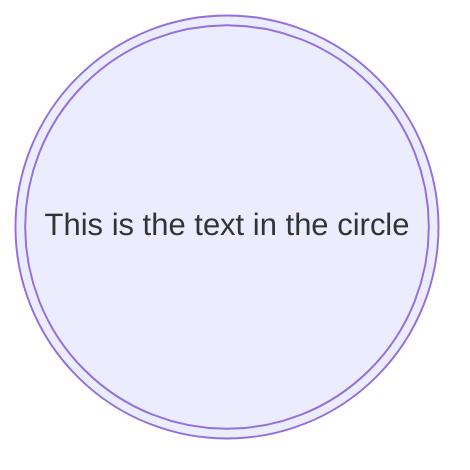


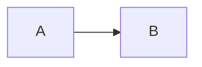


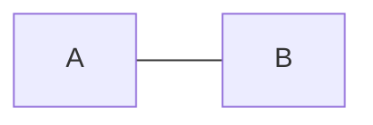


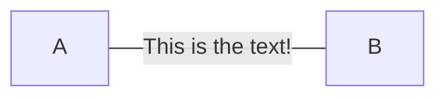


```mermaid

flowchart LR
    A---|This is the text|B

```


```mermaid
flowchart LR
    A-->|text|B


```


```mermaid
flowchart LR
   A-.->B;


```


```mermaid
flowchart LR
   A-. text .-> B


```


```mermaid

flowchart LR
   A ==> B

```


```mermaid

flowchart LR
   A == text ==> B

```


```mermaid

flowchart LR
   A -- text --> B -- text2 --> C

```


```mermaid
flowchart LR
   a --> b & c--> d


```


```mermaid
flowchart TB
    A & B--> C & D


```


```mermaid
flowchart TB
    A --> C
    A --> D
    B --> C
    B --> D


```


```mermaid
flowchart LR
    A --o B
    B --x C


```


```mermaid
flowchart LR
    A o--o B
    B <--> C
    C x--x D


```


```mermaid
flowchart TD
    A[Start] --> B{Is it?}
    B -->|Yes| C[OK]
    C --> D[Rethink]
    D --> B
    B ---->|No| E[End]


```


```mermaid
flowchart TD
    A[Start] --> B{Is it?}
    B -- Yes --> C[OK]
    C --> D[Rethink]
    D --> B
    B -- No ----> E[End]


```


```mermaid

flowchart TB
    c1-->a2
    subgraph one
    a1-->a2
    end
    subgraph two
    b1-->b2
    end
    subgraph three
    c1-->c2
    end

```


```mermaid
flowchart TB
    c1-->a2
    subgraph one
    a1-->a2
    end
    subgraph two
    b1-->b2
    end
    subgraph three
    c1-->c2
    end
    one --> two
    three --> two
    two --> c2


```


```mermaid

flowchart LR
  subgraph TOP
    direction TB
    subgraph B1
        direction RL
        i1 -->f1
    end
    subgraph B2
        direction BT
        i2 -->f2
    end
  end
  A --> TOP --> B
  B1 --> B2

```


```mermaid
flowchart LR
    id1(Start)-->id2(Stop)
    style id1 fill:#f9f,stroke:#333,stroke-width:4px
    style id2 fill:#bbf,stroke:#f66,stroke-width:2px,color:#fff,stroke-dasharray: 5 5


```


```mermaid
flowchart TD
    B["fab:fa-twitter for peace"]
    B-->C[fa:fa-ban forbidden]
    B-->D(fa:fa-spinner)
    B-->E(A fa:fa-camera-retro perhaps?)


```


```mermaid


```


```mermaid


```


```mermaid


```


```mermaid


```


```mermaid


```


```mermaid


```


```mermaid


```


```mermaid


```


```mermaid


```


```mermaid


```


```mermaid


```


```mermaid


```


```mermaid


```


```mermaid


```


```mermaid


```


```mermaid


```


```mermaid


```


