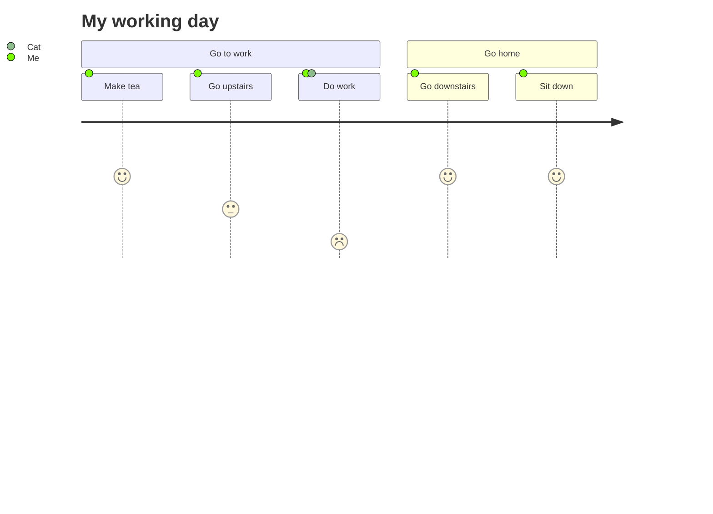
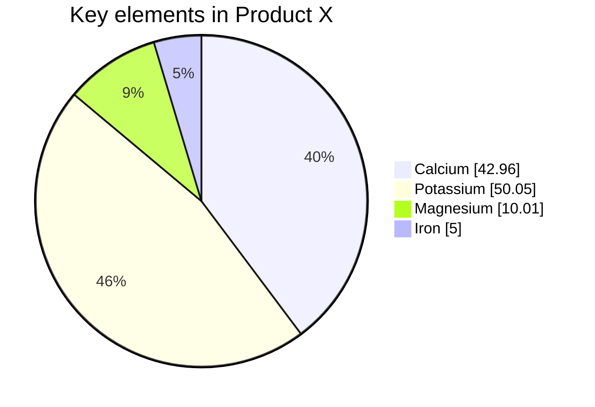

### Here's a topoJSON map in markdown

```topojson
 {"type":"Topology","transform":{"scale":[0.003589294092944858,0.0005371535195261037],"translate":[-179.1473400003406,17.67439566600018]},"objects":{"counties":   {"type":"GeometryCollection","geometries":[{"type":"MultiPolygon","arcs":[[[0,1,2,3]]],"id":53073},{"type":"Polygon","arcs":[[4,5,6,7,8,9]],"id":30105},{"type":"Polygon","arcs": [[10,11,12,1
 ...
```

### Here's an STL 3D render in markdown

```stl
solid cube_corner
  facet normal 0.0 -1.0 0.0
    outer loop
      vertex 0.0 0.0 0.0
      vertex 1.0 0.0 0.0
      vertex 0.0 0.0 1.0
    endloop
  endfacet
  ...
```


**The Cauchy-Schwarz Inequality**
$$\left( \sum_{k=1}^n a_k b_k \right)^2 \leq \left( \sum_{k=1}^n a_k^2 \right) \left( \sum_{k=1}^n b_k^2 \right)$$


This sentence uses `$` delimiters to show math inline:  $\sqrt{3x-1}+(1+x)^2$


| Left-aligned | Center-aligned | Right-aligned |
| :---         |     :---:      |          ---: |
| git status   | git status     | git status    |
| git diff     | git diff       | git diff      |

| Name     | Character |
| ---      | ---       |
| Backtick | `         |
| Pipe     | \|        |

| Command | Description |
| --- | --- |
| `git status` | List all *new or modified* files |
| `git diff` | Show file differences that **haven't been** staged |


| First Header  | Second Header |
| ------------- | ------------- |
| Content Cell  | Content Cell  |
| Content Cell  | Content Cell  |

| Command | Description |
| --- | --- |
| git status | List all new or modified files |
| git diff | Show file differences that haven't been staged |

//

<details><summary>CLICK ME</summary>
<p>

#### We can hide anything, even code!

```ruby
   puts "Hello World"
```

</p>
</details>
//


//

genereated from https://geojson.io/#new&map=4.31/13.12/76.18
```geojson

{
  "type": "FeatureCollection",
  "features": [
    {
      "type": "Feature",
      "properties": {},
      "geometry": {
        "coordinates": [
          77.71505091063119,
          11.960770448740618
        ],
        "type": "Point"
      }
    },
    {
      "type": "Feature",
      "properties": {},
      "geometry": {
        "coordinates": [
          77.2743047433371,
          10.916138337076788
        ],
        "type": "Point"
      }
    },
    {
      "type": "Feature",
      "properties": {},
      "geometry": {
        "coordinates": [
          78.16672667039211,
          11.57214490381837
        ],
        "type": "Point"
      }
    },
    {
      "type": "Feature",
      "properties": {},
      "geometry": {
        "coordinates": [
          [
            76.05221763780435,
            13.572023385430569
          ],
          [
            79.66018822923814,
            13.643722967718901
          ],
          [
            78.08721461268459,
            9.776078846284008
          ],
          [
            76.68867579622503,
            9.816474753153855
          ],
          [
            75.82950079955182,
            12.042023925889879
          ],
          [
            75.98802175362266,
            13.540768113445608
          ]
        ],
        "type": "LineString"
      }
    }
  ]
}
```


//

//




//

//




//
//


//

//


//

//


//
//


//

//


//

//


//
//


//

//


//

//


//
//


//

//


//

//


//
//


//

//


//

//


//
//


//

//


//

//


//
//


//

//


//

//


//
//


//

//


//

//


//
//


//

//


//

//


//
//


//

//


//

//


//
//


//

//


//

//


//
//


//

//


//

//


//
//


//

//


//

//


//
//


//

//


//

//


//
//


//

//


//

//


//
//


//

//


//

//


//
