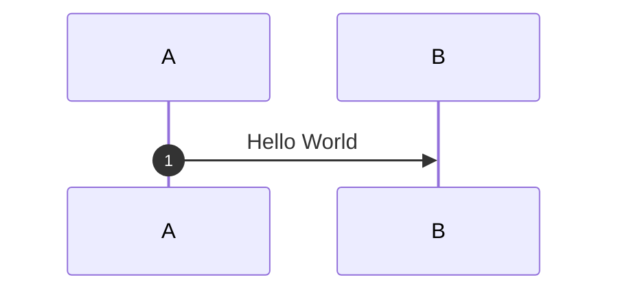
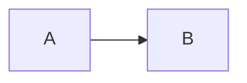
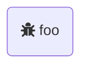

```mermaid
sequenceDiagram
    autonumber
    A ->> B: Hello World
    links A: {"google": "https://google.com", "github": "https://github.com"}
```

#

```mermaid
flowchart LR
    A-->B
    click A "http://www.github.com" _blank
    click B "http://www.github.com" "Open this in a new tab" _blank


```
#

```mermaid
flowchart LR
    A-->B
    click A "http://www.github.com" _blank
    click B "http://www.github.com" "Open this in a new tab" _blank

```

# 

```mermaid
graph TD
    foo(fa:fa-bug foo)
```